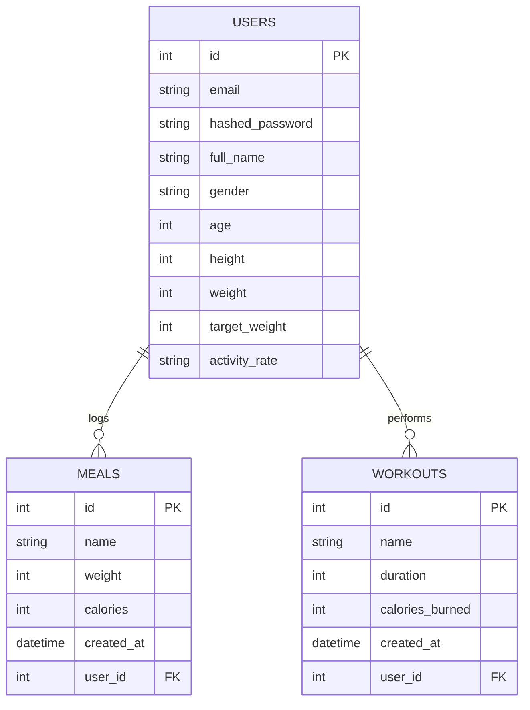

# Database Schema Documentation

This document outlines the database schema for the Smart Nutrition Tracker application.

## Tables

### 1. Users (`users`)
Stores user account information and profile details.

| Column Name | Type | Constraints | Description |
| :--- | :--- | :--- | :--- |
| `id` | Integer | Primary Key, Index | Unique identifier for the user. |
| `email` | String | Unique, Index, Not Null | User's email address (used for login). |
| `hashed_password` | String | Not Null | Securely hashed password. |
| `full_name` | String | Nullable | User's full name. |
| `gender` | String | Nullable | User's gender. |
| `age` | Integer | Nullable | User's age. |
| `height` | Integer | Nullable | User's height in cm. |
| `weight` | Integer | Nullable | User's current weight in kg. |
| `target_weight` | Integer | Nullable | User's target weight in kg. |
| `activity_rate` | String | Nullable | User's activity level (e.g., sedentary, active). |
| `start_weight` | Integer | Nullable | User's starting weight in kg. |
| `goal_weight` | Integer | Nullable | User's goal weight in kg. |

**Relationships:**
*   **One-to-Many** with `meals` (A user can have multiple meals).
*   **One-to-Many** with `workouts` (A user can have multiple workouts).

---

### 2. Meals (`meals`)
Stores food and meal records logged by users.

| Column Name | Type | Constraints | Description |
| :--- | :--- | :--- | :--- |
| `id` | Integer | Primary Key, Index | Unique identifier for the meal. |
| `name` | String | Index | Name of the meal or food item. |
| `weight` | Integer | | Weight of the portion in grams. |
| `calories` | Integer | | Total calories for the meal. |
| `created_at` | DateTime | Default: Now | Timestamp when the record was created. |
| `user_id` | Integer | Foreign Key (`users.id`) | ID of the user who logged the meal. |

**Relationships:**
*   **Many-to-One** with `users` (Belongs to a specific user).

---

### 3. Workouts (`workouts`)
Stores exercise and workout sessions logged by users.

| Column Name | Type | Constraints | Description |
| :--- | :--- | :--- | :--- |
| `id` | Integer | Primary Key, Index | Unique identifier for the workout. |
| `name` | String | Index | Name of the exercise or activity. |
| `duration` | Integer | | Duration of the workout in minutes. |
| `calories_burned` | Integer | | Estimated calories burned. |
| `created_at` | DateTime | Default: Now | Timestamp when the record was created. |
| `user_id` | Integer | Foreign Key (`users.id`) | ID of the user who logged the workout. |

**Relationships:**
*   **Many-to-One** with `users` (Belongs to a specific user).

## Entity Relationship Diagram (ERD)

